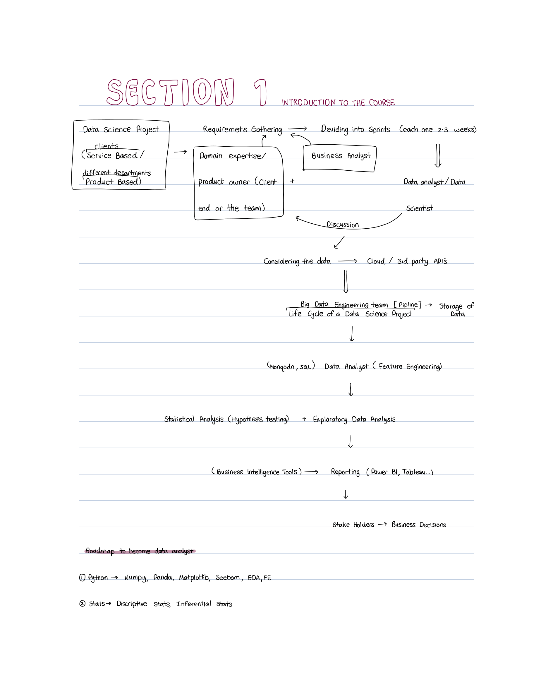
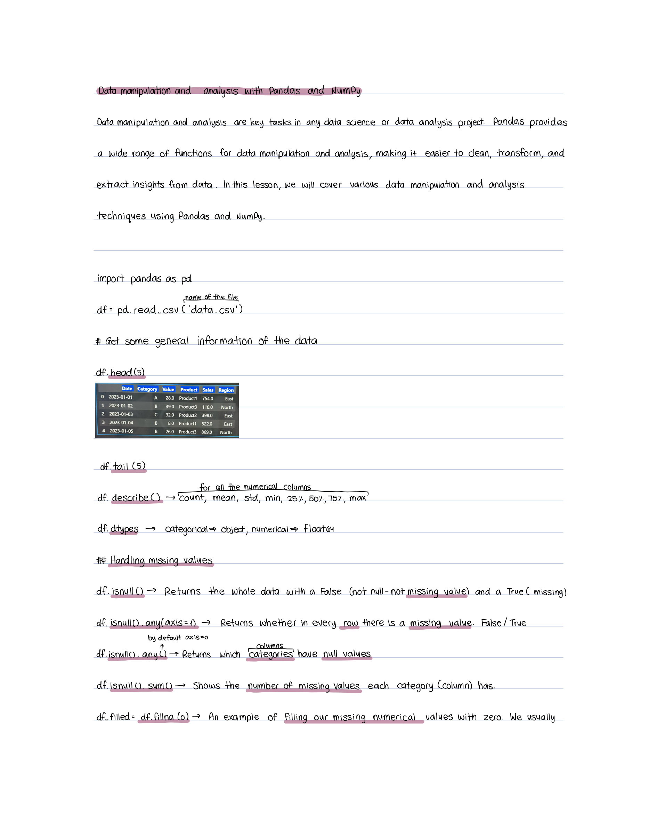
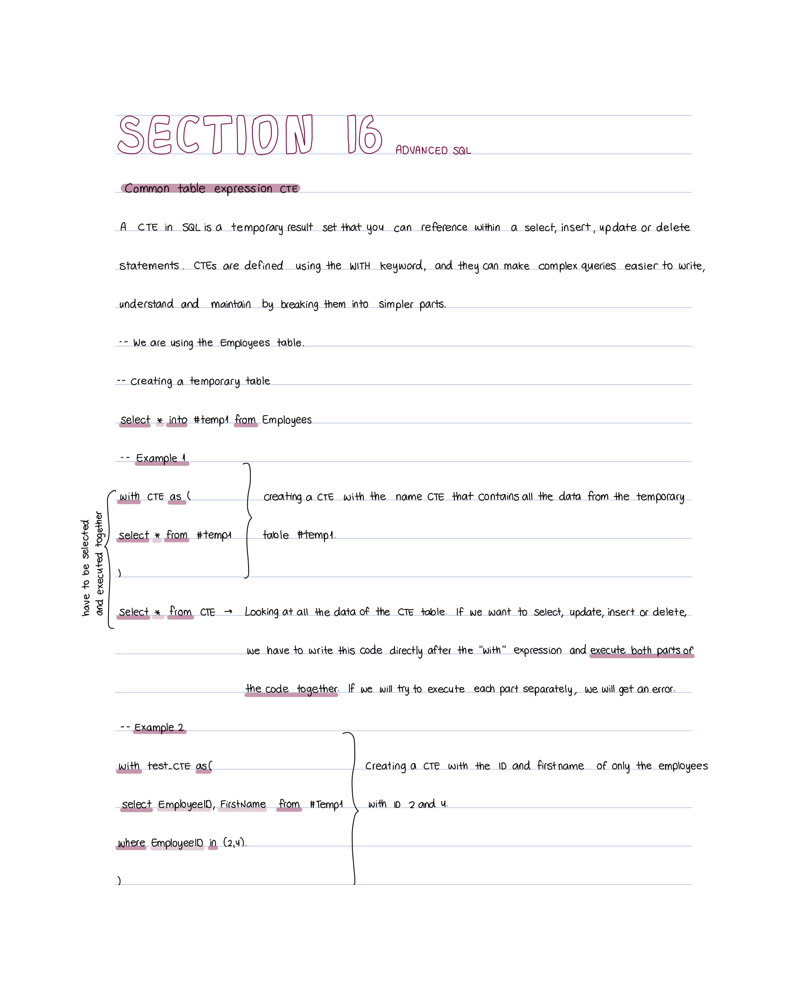
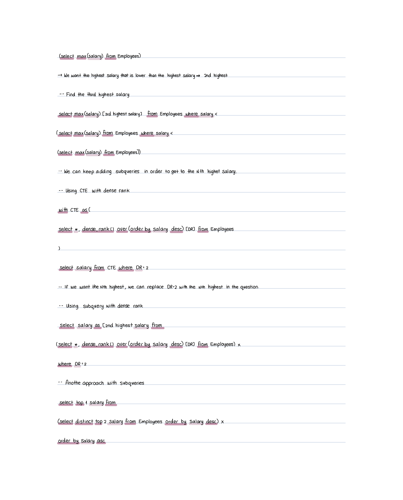
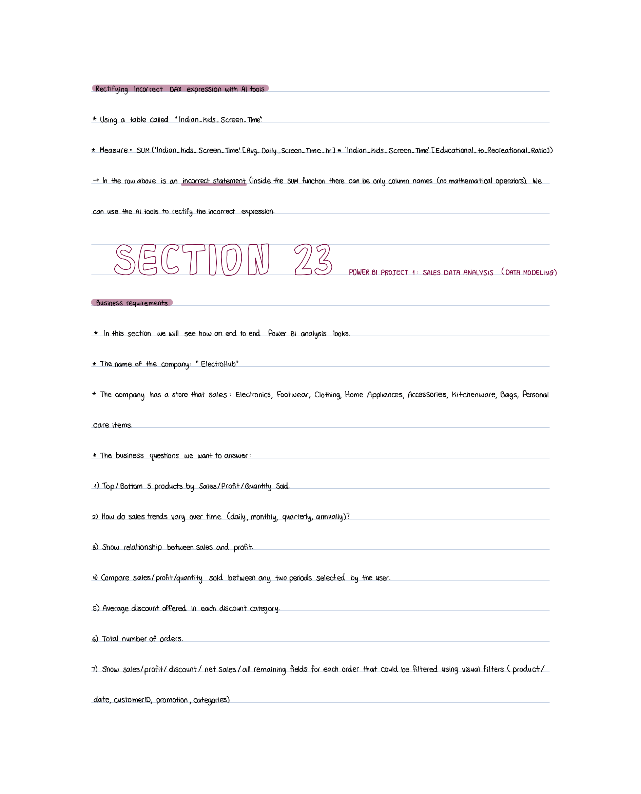
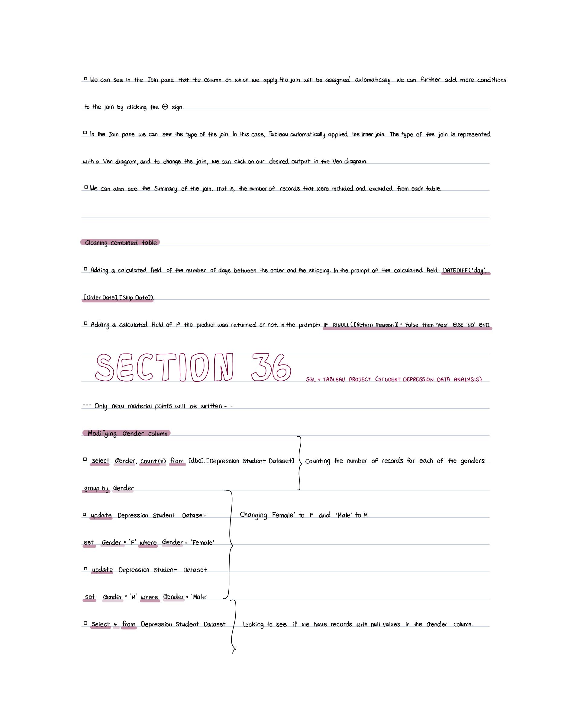

# Data Analytics Course Notes
This repository contains my handwritten notes and exercises from an 89-hour Data Analyst Bootcamp. The notebook documents my learning process across Python, SQL, Power BI, Tableau, Snowflake, and other data analytics concepts and tools.
The notes progress from foundational programming and data concepts to data analysis, visualization, and hands-on projects.

## Topics Covered
* Python fundamentals and data analysis with Pandas
* SQL including joins, subqueries, CTEs, and window functions
* Data visualization and dashboard development with Power BI
* DAX, data modeling, and business-focused analysis
* Tableau and Tableau Prep
* Snowflake and introductory cloud/data warehouse concepts
* Hands-on exercises and analytical projects

## Full Notebook

The complete 305-page handwritten notebook is available here:
[View the full Data Analytics Course Notes](data_analyst_course_notes.pdf)

## Selected Highlights
### Data Analytics Workflow
Overview of the data analytics process and the tools used throughout the course.

### Data Analysis with Pandas
Exploratory data analysis and data manipulation using Python and Pandas.

### Advanced SQL — CTEs
Notes and examples covering Common Table Expressions and advanced SQL concepts.

### SQL Window Functions
Examples combining CTEs, subqueries, and SQL window functions such as DENSE_RANK.

### Power BI Project
Business requirements and analytical questions developed as part of a Power BI sales analysis project.

### SQL & Tableau Project
Notes from a hands-on project combining SQL analysis with Tableau visualization.

